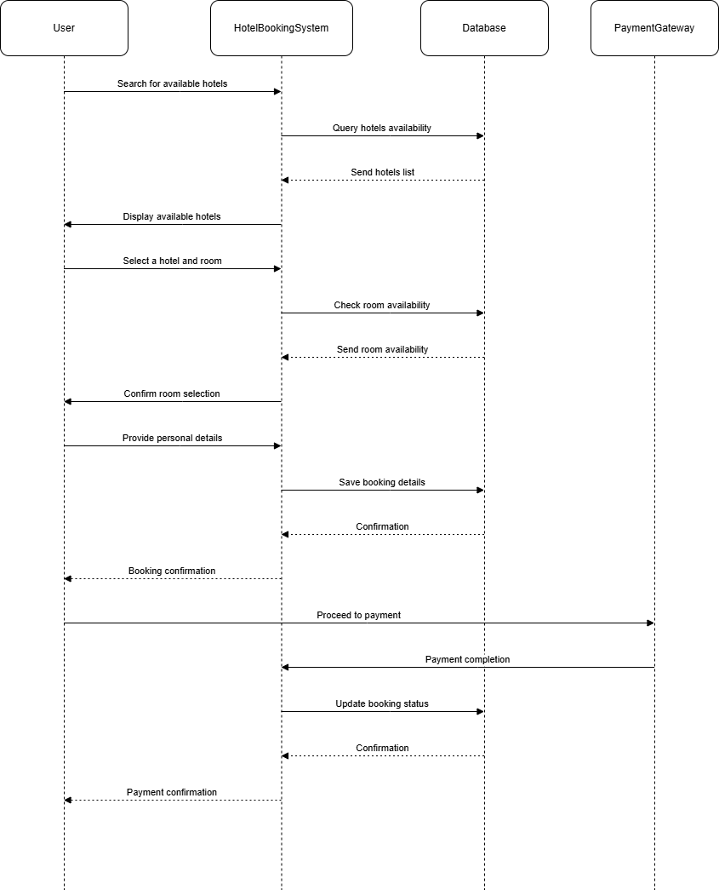

# requirement-analysis
# Requirement Analysis in Software Development.
 The purpose of this reprository is the requirement analysi for a booking management system, here will identify and categorize functional and non-functional requirements for scalable system

 # What is Requirement Analysis?
  It is the crutal phase in the software development lifecycle (SDLC) where the project team gathers, analyzes, and defines the requirements of the software product to be developed.  

  # Important of Requirement Analysis

  Requirement analysis is important because it provides clarity and understanding to what the stakeholders expect from the software, its scope a clear definition of the project. It also provides a soild foundation for designing and developing the system, it facilitates accurate estimate of the project cost, resources and time. Lastly Quality assurance which ensures that the final product meet the specified requirements which leads to customer satisfaction

  # Key Activities in Requirement Analysis

There are 5 Key Activities in Requirement Analysis:

1. Requirement Gathering
    - There are multiple ways of gathering information which involves Interviews, Surveys, Workshop,        Observation, Document Analysis to help get all the details from the stakeholders.
2. Requirement Elicitation
    - This will involve brainstorming ideas to better understand the requirement, holding focus groups with selected stakeholders to gather details required. There will be also a prototype to help stakeholders to visulize the system and refine thier requirement.
3. Requirement Documentation
    - Creating a detailed document that lists all functional and non-functional requirements.
4. Requirement Analysis and Modeling
    - 
5. Requirement Validation
    - 

# Functional Requirement and Non-Functional Requirement

- Functional these are all the requirements that the website should have the following 
    Search Properties: Users should be able to search for properties based on various criteria such as location, price, and availability.
    According to the case study the View booking services is a functioanl requirement because it where the managers and customers view details and get data and increase the performance of the app 
    

- Non-Functional describes how the system should perform, how well it performs, the security it should have and secure login. Final Design is a non functional beause it looks at all the the functionality of the app and go throught the DB to conduct research like business analysis, finding potential customers etc.

# Use Case Diagrams

### What are Use Case Diagrams?
Use Case Diagrams visually represent the interactions between users (actors) and the system to achieve specific goals. They help capture functional requirements during the Requirement Analysis phase.

### Benefits:
- Provides a high-level overview of the system's functionality.
- Clarifies interactions between users and the system.
- Ensures all requirements are captured before development.

### Use Case Diagram for Booking System
Below is the Use Case Diagram for the booking system:

